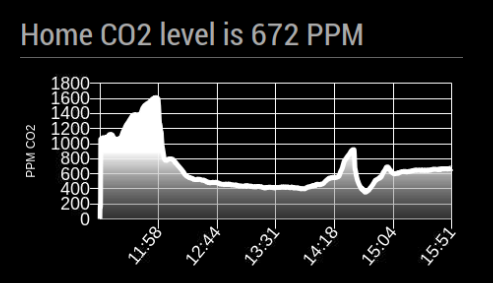
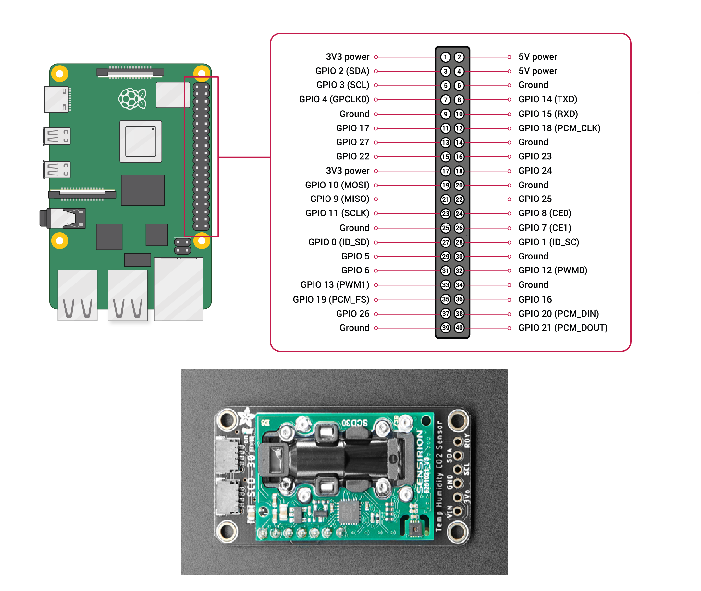

# MMM-SCD-30

  

This is an extension for the [MagicMirror²](https://github.com/MichMich/MagicMirror).

It monitors CO2 level from [SCD-30 sensor](https://learn.adafruit.com/adafruit-scd30/overview) and draws a chart for a few last hours.

  



  

## Installation

1. Navigate into your MagicMirror's `modules` folder

2. Clone repository `git clone https://github.com/Yours3lf/MMM-SCD-30`

3. Go to newly created directory

4. Execute `npm install` to install the node dependencies.
 > If you got error, try to execute `npm install chartjs`
  
5. Connect the SCD-30 to your Raspberry Pi. See command: `pinout`

6. Make sure to enable I2C interface via raspi-config. Look for 0x61 on Bus 1. Check using `sudo apt install i2c-tools && i2cdetect -y 1`

7. Make sure to mark the scd_30.sh script as executable: `sudo chmod +x scd_30.sh`

7. Make sure your user running magicmirror is in the i2c group (eg. user called pi): `sudo usermod -aG i2c pi`



| Raspberry Pi | SCD-30 |
|--|--|
| 3.3V DC power | VIN |
| GPIO2 SDA1 | SDA |
| GPIO3 SCL1 | SCL |
| GPIO4 GPCLK0 | skip |
| Ground | GND |

https://learn.adafruit.com/adafruit-scd30/python-circuitpython

  

## Using the module

  

Add it to the modules array in the `config/config.js` file:

  

````javascript
modules: [
	...
	{
		module:  'MMM-SCD-30',
		position:  'bottom_right',
		config: {
			updateInterval:  100  //seconds
			}
	},
	...
]
````

  

## Configuration options

  

Configurations properties

  | Property| Description |
|--|--|
|  `titleText` | **Type**  `string`, **Default value** `Home weather`|
|  `updateInterval` | **Type**  `int`, **Default value** `100`, **Minimal value** `10`, Wait interval between readings of sensor values in seconds|

  

## Dependencies

-  `python3` (should be installed on Raspberry Pi)

-  `adafruit-circuitpython-scd30` (Python library for the readings, installed the first time scd_30.sh runs )

  

## Test SCD-30 module

1. Navigate into your **MagicMirror** folder
2. Run .sh script `./modules/MMM-SCD-30/scd_30_.sh`
(If script doesn't run, add exec parameter to it)
`sudo chmod +x modules/MMM-SCD-30/scd_30_.sh`.
3. Script should print sensor values like this
`566` - that means `CO2 PPM in air`
  

### Thanks

  
[MMM-MHZ19 module](https://github.com/awitwicki/MMM-MHZ19)
[MMM-DHT-Sensor module](https://github.com/bernardpletikosa/MMM-DHT-Sensor)
